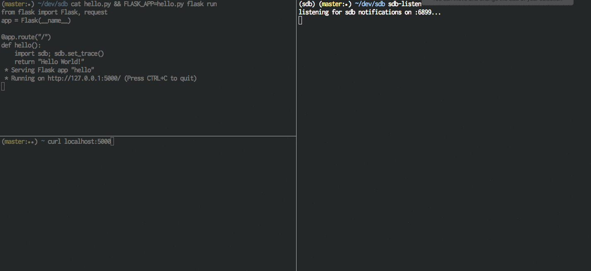

Sdb
===
A socket-based remote debugger for Python.  Based on `celery.contrib.rdb`.



Usage
-----

Use the `sdb` library to set remote breakpoints in any non-interactive or
background Python code and debug interactively over a telnet session:

```python
   # some/python/code.py

   class SomeCode(object):

       def run(self, **kwargs):
           # This will set a breakpoint and open an interactive Python
           # debugger exposed on a random port between 6899-6999.  The chosen
           # port will be reported as a warning
           #
           # Remote Debugger:6900: Please telnet into 0.0.0.0 6900.
           #
           # You can access it from your host machine using telnet:
           #
           # $ telnet <hostname> <port>
           import sdb
           sdb.set_trace()
```

Keep in mind that when you interactively debug in this way, any process
that encounters a breakpoint will wait until an active client is established
and concludes the debugging session with a `continue` command.

Automatically Connecting to Breakpoints
---------------------------------------

To simplify remote debugging session management, you can use `sdb-listen`
to automatically discover open remote debugging sessions and connect to them:

```shell
   $ sdb-listen
```

This will open a Python process that listens for new debugger sessions and
automatically connects to them for you.  If your breakpoint is run on
an _entirely different host_, you can optionally specify the hostname where
`sbd-listen` is running:

```python
   import sdb
   sdb.Sdb(notify_host='docker.for.mac.host.internal').set_trace()
```

The `sbd-listen` tool also includes support for tab-completion and history
tracking.

Triggering sdb with a Signal
----------------------------
If you want to debug a running process without setting a specific breakpoint,
a `set_trace()` call can be triggered via `SIGTRAP`:

```python
import sdb
sdb.sigtrap()

long_running_process()
```

```shell
$ kill -5 <pid-of-process>
```

This is particularly useful for investigating Python processes that appear to
be hung.


Other Tips
----------
`sdb` supports the same commands and aliases as Python's [default pdb implementation](https://docs.python.org/2/library/pdb.html#debugger-commands).

`sdb` colorizes output by default.  To disable this:


```python
   import sdb
   sdb.Sdb(colorize=False).set_trace()
```

`sdb` includes a few additional debugger aliases that make interactive debugging more pleasant:

- Prefix commands with an integer to repeat them.  For example, `10n` is the same as running `next` 10 times in a row.
- `?` is the same as calling `dir()`
- `??` can be added to the end of a function call to view its source lines e.g., `requests.post??` might print:

```python
def post(url, data=None, json=None, **kwargs):
    r"""Sends a POST request.

    :param url: URL for the new :class:`Request` object.
    :param data: (optional) Dictionary (will be form-encoded), bytes, or file-like object to send in the body of the :class:`Request`.
    :param json: (optional) json data to send in the body of the :class:`Request`.
    :param \*\*kwargs: Optional arguments that ``request`` takes.
    :return: :class:`Response <Response>` object
    :rtype: requests.Response
    """

    return request('post', url, data=data, json=json, **kwargs)
```
- By default, `sdb` attempts to fill your entire console with debugger output (representing the current line position for the current frame).  You can adjust the height of `sdb`'s draw window with the `lines` command, e.g., `lines 15`.
