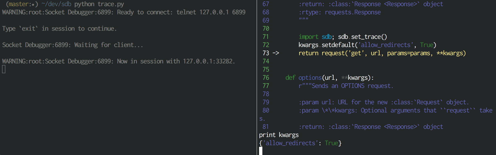

Sdb
===
A socket-based remote debugger for Python.  Based on `celery.contrib.rdb`.



Usage
-----

Use the `sdb` library to set remote breakpoints in any non-interactive or
background Python code and debug interactively over a telnet session:

```python
    # some/python/code.py

    class SomeCode(object):

        def run(self, **kwargs):
            # This will set a breakpoint and open an interactive Python
            # debugger exposed on a random port between 6899-6999.  The chosen
            # port will be reported as a warning
            #
            # Remote Debugger:6900: Please telnet into 0.0.0.0 6900.
            #
            # You can access it from your host machine using telnet:
            #
            # $ telnet <hostname> <port>
            import sdb
            sdb.set_trace()
```

Keep in mind that when you interactively debug in this way, any process
that encounters a breakpoint will wait until an active client is established
and concludes the debugging session with a `continue` command.

Automatically Connecting to Breakpoints
---------------------------------------

To simplify remote debugging session management, you can use `sdb-listen`
to automatically discover open remote debugging sessions and connect to them:

```
$ sdb-listen
```

This will open a Python process that listens for new debugger sessions and
automatically connects to them for you.  If your breakpoint is run on
an _entirely different host_, you can optionally specify the hostname where
`rbd-listen` is running:

```python
import sdb
sdb.set_trace(notify_host='docker.for.mac.localhost')
```
